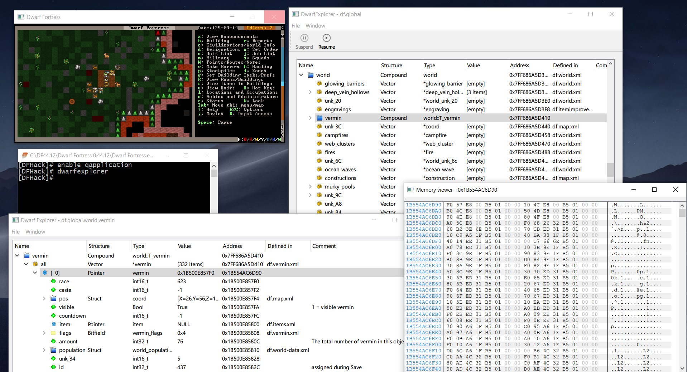
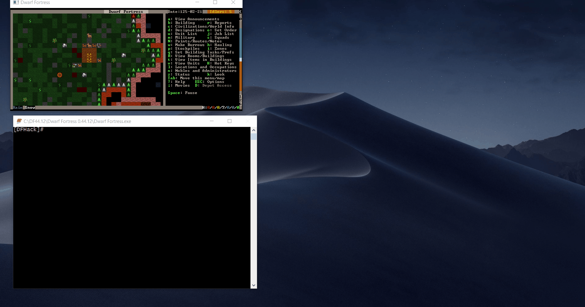
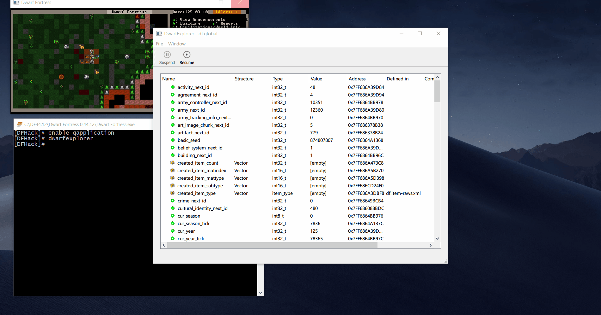
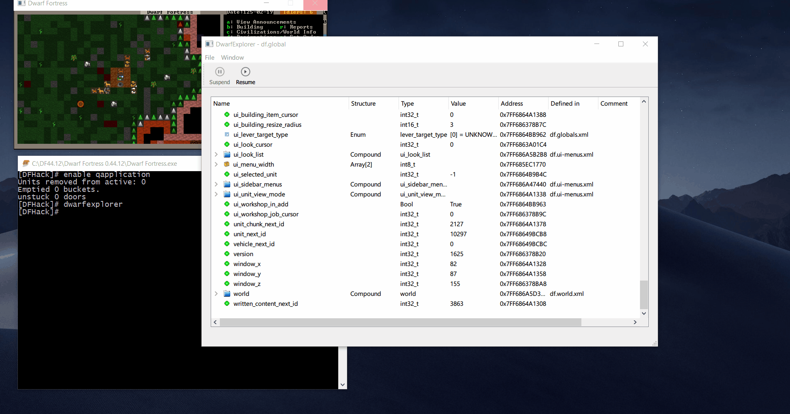
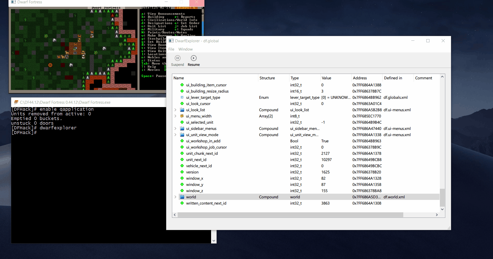
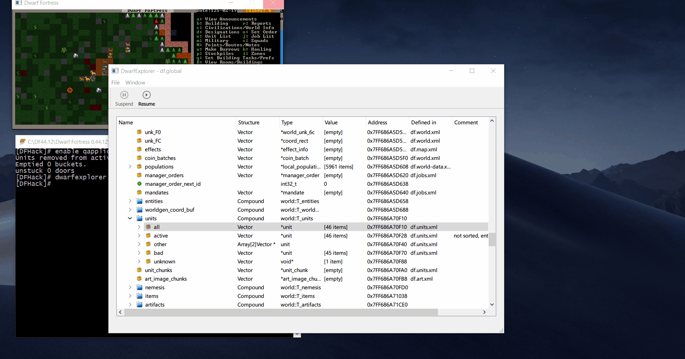

DwarfExplorer
=============
A DFHack plugin for browsing Dwarf Fortress internal structures (Windows/Linux).

**NEW!!** Linux release available. See below for installing instructions.

Features
--------

* Graphical viewer for all Dwarf Fortress structures known from DFHack.
* Open any individual structure in a new window for easy understanding.
* All structure types supported (vectors, arrays, pointers, enums, unions, bitfields, etc).
* Hexadecimal memory viewer for Dwarf Fortress process memory.
* Show comments and 'refers-to' (if defined) attributes for fields in structures.
* Show the dfhack xml file where each structure is defined.
* Stores opened df structures so you can track evolution of the structures in time (rather primitive right now).
* Automatic decoding of enums, bitfields, coordinates and language names.
* Decoding of derived classes showing its hierarachy.

Motivation
----------
We all know gm-editor, the wonderful in game browser invaluable for researching Dwarf Fortress internal structures. Dwarf Explorer does something similar with the following advantages:

* A treeview allows a better understanding of a structure. You can expand/compact fields as you wish. 
gm-editor changes to a new screen each time you move down in the structure.
* DFHack has a hex memory viewer, but is a command line one. Dwarf Explorer allows you to open a hex memory viewer for each field of a df structure and even follow pointers.

Dwarf Explorer has also some disavantadges:
* Right now you can't change values in Dwarf Fortress memory.
  This is something that will change in future versions of the plugin. 
  Use gm-editor for that task.

---

Qt DFHack plugins, what sorcery is this?
----------------------------------------
You need to thanks Clement. Yes that Clement, the one that maintains Dwarf Therapist.

He found a method for loading Qt inside DFHack, so you can create multiplatform graphical applications running in the same process as Dwarf Fortress.

Think about that. You get access to all the abilities that DFHack provides for plugins, and you can show all that information graphically!

---

How do I install the plugin?
----------------------

First, download the plugin from github. https://github.com/ragundo/DwarfExplorer/releases
You need to download the plugin for the dfhack version that you have installed in your computer.

### Windows

Extract all the files to the Dwarf Fortress installation directory.

You will get six files:

* `dwarfexplorer.plug.dll`
* `qapplication.dll`
* `Qt5Core.dll`
* `Qt5Gui.dll`
* `Qt5Widgets.dll`
* `qwindows.dll`

The first and second ones are the dfhack plugin libraries and are installed in the subdirectory `/hack/plugins`.

Qt5Core, Qt5Gui and Qt5Widgets are installed in the Dwarf Fortress directory.

qwindows.dll is installed in a subdirectory called `platforms`.

### Linux

Install Qt using your package manager. For example, In Ubuntu type:

`sudo apt-get install qt5-default`

After that, extract all the files to the Dwarf Fortress installation directory.

You will get two files:

* `dwarfexplorer.plug.dll`
* `qapplication.dll`

These files are the dfhack plugin libraries and are installed in the subdirectory `/hack/plugins`.

**NOTE:** If you are using the Lazy Newcomers Pack for Linux http://dffd.bay12games.com/file.php?id=12762 the you must download the plugin compiled for GCC4.8. If you install the GCC8 version of the plugin, it will not work

---

How do I run the plugin?
----------------------

<b>Dwarf Explorer only works in PAUSED games</b>.

There's no way that the plugin can track all the data that changes in Dwarf Fortress in real time, so the plugin automatically pauses the game, gets the data from DF and shows it.

Launch Dwarf Fortress (and DFHack of course) and load your world.
In the dfhack console type:

`enable qapplication`

This loads the Qt dynamic libraries into Dwarf Fortress process.

After that, launch the graphical viewer typing

`dwarfexplorer`

The plugin window will be displayed without any data, just telling you that Dwarf Fortress is running.

You need to pause Dwarf Fortress using the Suspend button in the toolbar. When you do this, Dwarf Fortress will pause and the plugin window will display all the known global variables (aka df.global).

You can now browse all the data, view memory, open new windows, etc. When you are done, press the resume button in the toolbar and continue playing.

---

Where's the data?
----------------------
The most important global variable is world (df.global.world). This structure has all the data that your fortress uses. So, navigate to the bottom of the windows and locate world.

Then expand the tree and marvel about all the glorious Dwarf Fortress data.

If your tree gets convoluted with too much data, you can also open any structure in a new window by selecting it and using the menu `Window->Open in new window`.

---

Some DF data examples
----------------------

* Where are my dwarves? 
  They are in the vector df.global.world.units.active

* How much vermin exists in my embark? 
  Check vector df.global.world.vermin.all.

* What about the fortress buildings? 
  vector df.global.world.buildings.all

* Where is the rest of the world data? 
  It's in the pointer df.global.world.world_data

* What's the tallest mountain in the world? 
  Look for the field height in df.global.world.world_data.mountain_peaks vector

---

The memory viewer
----------------------
As you browse Dwarf Fortress data, you will encounter a lot of unknow structures (data where we know the C++ type of the field but we don't know its meaning related to the game).

For every field or df structure, you can always see the Dwarf Fortress process memory where this data resides. To do that, select the field and click in the menu `Window->Open address in hex viewer`.

A memory viewer will open at the address where the field is stored.

For some C++ structures like vectors or pointers, the data has a another level of indirection.

If you open a memory viewer for a vector you will not get the real data. This is because the internal structure of a vector consists of three pointers, being the first pointer the one that points to the data beginning.

To do this operation easier, just select `Window->Open destination address in hex viewer` and you will get the hex memory viewer pointing to the real data.

---

Does it run with the LNP (Lazy Newcomers Pack)?
----------------------------------------------
Yes as long as your LNP version matches the plugin version.

If the plugin is compiled for DFHack 0.44.12, your LNP must be 0.44.12 also.

Linux users of the LNP must use the plugin compiled with GCC4.8

---

No MacOS?
----------------------------------------------
I've zero knowledge of Macs. In theory the code should be portable across operating systems (Qt strenght). But it seems that there are problems in that platform.

---

What happens when Dwarf Fortress / DFHack changes?
----------------------
The plugin code is generated automatically from DFHack `codegen.out.xml` file using a tool. 
Each time that a new DFHack version will be released, I'll update the plugin accordingly.

---

Bugs, suggestion, etc
----------------------
You can use github issues or contact me by irc in `#dfhack` in freenode.

---

Closing thoughts
----------------------

*The real *FUN* is not in your fortress but in the code!!!!*

I hope this tool will encourage more people to do researching in Dwarf Fortress. It'a fascinating puzzle ready to be assembled.
You can try to find relationship between known and unknown data, discover new structures or fields, etc. Then, open a pull request in https://github.com/DFHack/df-structures
for providing that valuable info to the community.

When you starts digging into Dwarf Fortress internals, you will be hooked. You can even try to advance to the next level and do some reverse engineering of Dwarf Fortress code using IDA or Ghidra.

---

Thanks
----------------------
Clement (https://github.com/cvuchener) for providing the wonderful framework in which this plugin runs.

lethosor (https://github.com/lethosor) and all the wonderful people of `#dfhack` channel in freenode.